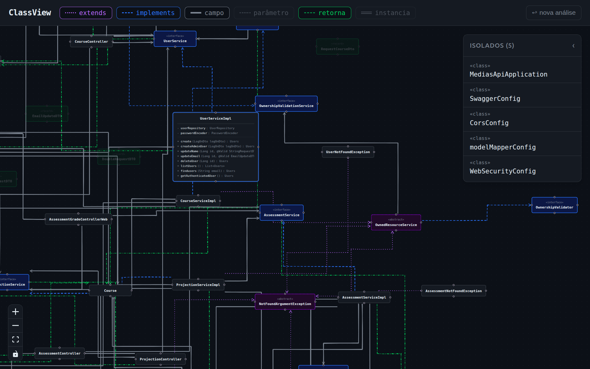

 # ClassView 

- 08/04/2026 escrita
- 14/04/2026 publicação

--- 

# Contexto 

 A classView é uma aplicação apenas front-end que eu criei com o objetivo de manter a organização e conseguir enxergar como as classes estão se relacionando nos projetos, sejam eles back-end ou 
 frontend, e também para praticar desenvolver com o React e typeScript, ela tem suporte a várias linguagens, e aprimorei ela para mostrar oque cada classe conhece, seja por parâmetro de entrada, 
 oque ela retorna, os campos que são outras classes, implementações, heranças e instâncias. É uma forma de tornar visual o desenvolvimento semelhante ao que eu fazia com as classes.md em cada projeto
 para auxiliar desenvolvedores 

 --- 
 # Objetivo

 Apresentar o site, como ele pode ajudar desenvolvedores, oque é possível visualizar e analisar, sinais que podemos perceber, como dependências circulares, ou conhecimentos indevidos, entre outros

 ---
 # Post 

ClassView - Grafo de Classes 

No dia a dia escrevendo um código acabamos criando diversas classes que se relacionam entre si de alguma forma, e precisamos nos preocupar com questões como acoplamento e arquitetura, antes eu procurava em cada projeto manter uma documentação chamada classes.md onde eu listava todas as classes e suas dependências, mas era necessário atualizá-lo constantemente conforme o projeto crescia. 

Resolvi então centralizar isso, e aproveitando que estava estudando sobre React o resultado foi uma simples página web que não precisa nem mesmo de backend. 

Nela você carrega o diretório ou sub diretório que desejar e em um grafo filtra quais relações deseja visualizar.

A aplicação tem suporte a várias linguagens - Java, Kotlin, C#, TypeScript, Python, PHP e Ruby.

E as relações:

- Implementações; 
- Heranças;
- Dependências(Injeção de dependência por campos, parâmetros de métodos, tipo de retorno e criação de instâncias);

E assim, pode-se analisar e observar indícios de dependências circulares, acoplamento indevido, quais classes são conhecidas por um domínio, etc.

Repositório : https://github.com/GustavoDaMassa/ClassView

ClassView: https://classview.gustavohdev.com.br/

