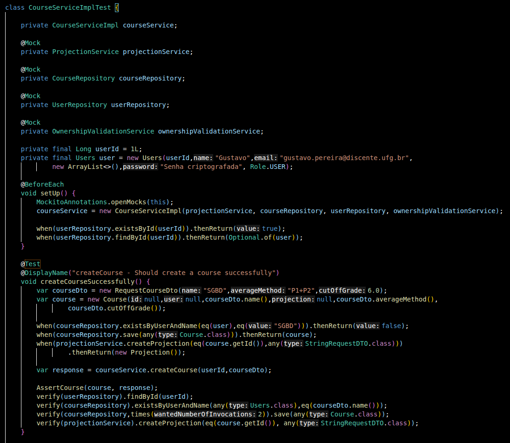
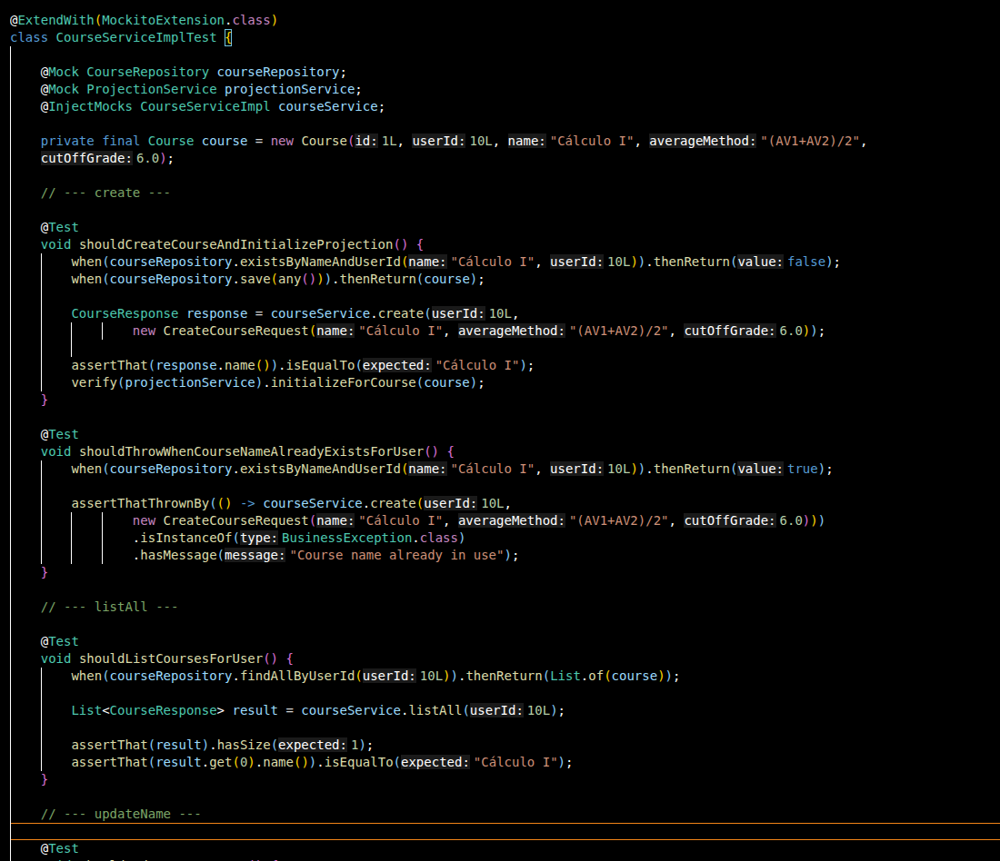

# Arquitetura Limpa - reimplementação da Medias API 

08/04/2026 escrita 
15/04/2026 publicação 

---
# Contexto 

Reimplementação completa da MediasAPI focando em refatorar o código para usar arquitetura limpa e exemplificar na prática as diferenças para a arquitetura em camadas e por domínio. 

---
# Objetivo 

Mostrar as principais diferenças entra as essa e a arquitetura anterior e quais as vantagens. 

--- 
# Post

na minha publicação anterior falei sobre o ClassView e uma das suas utilidades ser a visualização do que cada classe conhece no código.

aproveitando esse gancho, quero falar sobre algumas vantagens da arquitetura limpa, de forma contextualizada, pois há um tempo fiz uma reimplementação da MediasAPI onde podemos observá-las na prática.

A ideia central da Clean Architecture é simples: o domínio — onde vivem as regras de negócio — não conhece ninguém. Framework, banco de dados, segurança: tudo isso é detalhe de infraestrutura.
Os principais benefícios disso é que podemos trocar banco de dados, mecanismo de autenticação ou qualquer detalhe técnico sem mexer no domínio,
e ao meu ver o mais interessante é a testabilidade se tornar trivial, pois não é necessário subir Spring, Banco em Memória ou mocks de framework. 

Isso acontece porque o domínio é Java puro, é apenas instanciar e testar. Sem essa arquitetura entidades carregam anotações do framework que exigiriam um contexto JPA por exemplo, para testes.

Não é sempre melhor que arquitetura em camadas — é adequada para domínios com lógica de negócio complexa que precisa ser isolada e testada de forma independente.

Vou deixar os dois repositórios para comparação, em cleanMediasAPI há também uma explicação mais completa sobre arquitetura limpa. 

MediasAPI (em camadas) : https://github.com/GustavoDaMassa/MediasAPI
cleanMediasAPI : https://github.com/GustavoDaMassa/cleanMediasAPI

